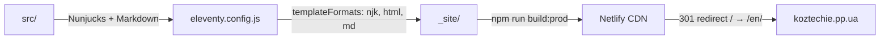
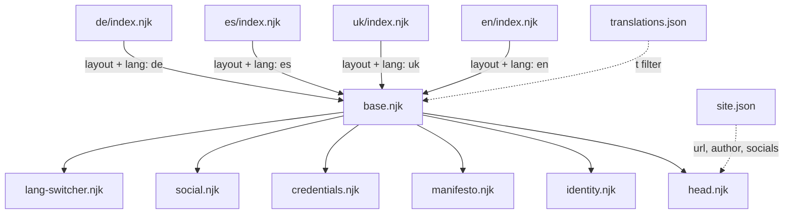

# koztechie

**Multilingual personal portfolio built with 11ty**

🌐 [koztechie.pp.ua](https://koztechie.pp.ua) · Author: **Eugene Kozlovsky**

---

[](https://koztechie.pp.ua)


-purple)

---

## Table of Contents

- [Features](#features)
- [Architecture Overview](#architecture-overview)
- [Directory Structure](#directory-structure)
- [Technology Stack](#technology-stack)
- [Getting Started](#getting-started)
- [Multilingual Setup](#multilingual-setup)
- [Deployment](#deployment)
- [Customization Guide](#customization-guide)
- [Scripts Overview](#scripts-overview)
- [License](#license)

---

## Features

- **Multilingual i18n** — 4 languages (English, Ukrainian, Spanish, German) with browser-language detection and `localStorage` preference persistence
- **Component-based Nunjucks architecture** — modular layout with reusable includes (`identity`, `manifesto`, `credentials`, `social`, `lang-switcher`)
- **Cyberpunk / cinematic UI** — cyan/magenta dual-accent palette, randomized glitch effects, SVG noise overlay, animated glow strips
- **Accessibility** — skip-link for keyboard navigation, `prefers-reduced-motion` support, semantic HTML, proper `aria-hidden` on decorative elements
- **SEO-optimized** — Schema.org structured data (`Person`, `WebSite`, `WebPage`), Open Graph, Twitter Cards, canonical URLs, `hreflang` alternates, `sitemap.xml`, `robots.txt`
- **Security-first** — Content Security Policy, HSTS, `X-Frame-Options: DENY`, `nosniff`, `Referrer-Policy`, `Permissions-Policy` — all configured via Netlify headers

---

## Architecture Overview

### Build Pipeline



### Component Hierarchy



---

## Directory Structure

```
koztechie/
├── eleventy.config.js          # ESM config — filters, passthroughCopy, dirs
├── package.json                # Scripts, devDependencies (@11ty/eleventy ^3.1.5)
├── netlify.toml                # Build command, redirects, security headers, cache
├── .node-version               # Node version pin
├── .nvmrc                      # Node version pin (nvm)
├── .gitignore
└── src/
    ├── index.njk               # Root redirect fallback → /en/
    ├── robots.txt               # Crawl rules + sitemap reference
    ├── sitemap.njk              # Dynamic XML sitemap template
    ├── _data/
    │   ├── site.json            # Global site metadata (url, author, socials)
    │   └── translations.json   # i18n strings for all 4 languages
    ├── _includes/
    │   ├── layouts/
    │   │   ├── base.njk         # Main layout — wires components + footer
    │   │   └── head.njk         # <head>: meta, OG, Twitter, Schema.org, fonts
    │   └── components/
    │       ├── identity.njk     # Name + title display with glitch target
    │       ├── manifesto.njk    # Personal manifesto block
    │       ├── credentials.njk  # Professional credentials / certificates
    │       ├── social.njk       # Social links (GitHub, X, Telegram, Facebook)
    │       └── lang-switcher.njk # Language navigation (en/uk/es/de)
    ├── assets/
    │   ├── css/
    │   │   ├── main.css         # Entry point — imports all partials
    │   │   ├── tokens.css       # Design tokens (colors, spacing, fonts)
    │   │   ├── reset.css        # Browser reset / normalize
    │   │   ├── typography.css   # Type scale + utility classes
    │   │   ├── layout.css       # Grid, wrapper, block-level layout
    │   │   └── glitch.css       # Glitch animation + reveal keyframes
    │   ├── js/
    │   │   ├── glitch.js        # Randomized glitch flicker on site name
    │   │   ├── cursor.js        # Staggered reveal-on-load controller
    │   │   └── lang-switcher.js # localStorage preference + browser redirect
    │   └── img/
    │       ├── eugene-kozlovsky.jpg  # Author portrait
    │       └── favicon.svg          # SVG favicon
    ├── en/
    │   └── index.njk            # English version (lang: en)
    ├── uk/
    │   └── index.njk            # Ukrainian version (lang: uk)
    ├── es/
    │   └── index.njk            # Spanish version (lang: es)
    └── de/
        └── index.njk            # German version (lang: de)
```

---

## Technology Stack

| Technology | Version | Purpose |
|---|---|---|
| [Eleventy (11ty)](https://www.11ty.dev/) | ^3.1.5 | Static site generator (ESM config) |
| Node.js | 20 | Runtime environment |
| Nunjucks | Built-in | Templating engine |
| Netlify | — | Hosting, CDN, headers, redirects |
| IBM Plex Mono | Google Fonts | Monospace typeface (300/400/700) |
| IBM Plex Sans | Google Fonts | Sans-serif typeface (300/400/500) |
| IBM Plex Serif | Google Fonts | Serif typeface (300/400) |
| Schema.org | — | Structured data (Person, WebSite, WebPage) |

---

## Getting Started

### Prerequisites

- **Node.js 20+** (pinned via `.node-version` / `.nvmrc`)

### Install

```bash
npm ci --include=dev
```

### Development server

```bash
npm start
```

Opens at [http://localhost:8080](http://localhost:8080) with live reload.

### Production build

```bash
npm run build:prod
```

Sets `NODE_ENV=production` and outputs static files to `_site/`.

### All npm scripts

| Script | Command | Description |
|---|---|---|
| `start` | `eleventy --serve --port=8080` | Dev server with live reload |
| `build` | `eleventy` | Standard build |
| `build:prod` | `NODE_ENV=production eleventy` | Production build |

---

## Multilingual Setup

The site supports **4 languages**: English (`en`), Ukrainian (`uk`), Spanish (`es`), and German (`de`).

### How it works

1. **Translation data** — All translatable strings live in `src/_data/translations.json`, keyed by language code. Each language provides: `title`, `description`, `manifesto`, `identity_line`, section labels, and `built_with`.

2. **`|t` filter** — Defined in `eleventy.config.js`, this filter retrieves the translation object for a given language code:
   ```javascript
   eleventyConfig.addFilter("t", function(lang) {
     return this.ctx?.translations?.[lang] || {};
   });
   ```
   Used in templates as `` at the top of `base.njk`.

3. **Language folders** — Each language has its own directory with an `index.njk` that sets `layout`, `lang`, `locale`, and `permalink`:
   ```
   src/en/index.njk  →  /en/
   src/uk/index.njk  →  /uk/
   src/es/index.njk  →  /es/
   src/de/index.njk  →  /de/
   ```

4. **Root redirect** — `src/index.njk` serves as a fallback redirect page pointing to `/en/`. Netlify also enforces a 301 redirect from `/` to `/en/` via `netlify.toml`.

5. **Client-side preference** — `lang-switcher.js` handles two responsibilities:
   - On the root path (`/`): redirects to the stored `localStorage` preference or falls back to the browser's `navigator.language`
   - On any language path (`/en/`, `/uk/`, etc.): saves the current language to `localStorage` under the key `koztechie_lang`

6. **SEO alternates** — `head.njk` outputs `<link rel="alternate" hreflang="...">` tags for all 4 languages plus `x-default`, ensuring proper multilingual indexing.

---

## Deployment

This project is deployed on **Netlify** with configuration defined in `netlify.toml`.

### Build configuration

```toml
[build]
  command = "npm ci --include=dev && npm run build:prod"
  publish = "_site"

[build.environment]
  NODE_VERSION = "20"
  NODE_ENV     = "production"
```

### Redirects

| From | To | Status |
|---|---|---|
| `/` | `/en/` | 301 (permanent) |

### Security headers

All pages (`/*`) receive the following headers:

| Header | Value |
|---|---|
| `Content-Security-Policy` | `default-src 'self'`; scripts self-only; styles allow Google Fonts; fonts from `fonts.gstatic.com`; images self + data URIs |
| `X-Frame-Options` | `DENY` |
| `X-Content-Type-Options` | `nosniff` |
| `Referrer-Policy` | `strict-origin-when-cross-origin` |
| `Permissions-Policy` | `camera=(), microphone=(), geolocation=()` |

### Cache strategy

| Pattern | Cache-Control | TTL |
|---|---|---|
| `/assets/*`, `/*.css`, `/*.js` | `public, max-age=31536000, immutable` | 1 year |
| `/sitemap.xml`, `/robots.txt` | `public, max-age=86400` | 1 day |

---

## Customization Guide

### Adding a new language

1. Add a new key to `src/_data/translations.json` with all required fields (`lang`, `locale`, `title`, `description`, `manifesto`, section labels, `built_with`)
2. Create a new folder `src/{lang_code}/index.njk` with frontmatter:
   ```yaml
   ---
   layout: layouts/base.njk
   lang: fr
   locale: fr_FR
   permalink: /fr/
   ---
   ```
3. Update `src/_includes/components/lang-switcher.njk` to include the new language in the navigation
4. Add a `<link rel="alternate" hreflang="fr">` entry in `src/_includes/layouts/head.njk`
5. Update the `SUPPORTED` array in `src/assets/js/lang-switcher.js`

### Adding a credential

Edit `src/_includes/components/credentials.njk` and add a new credential entry following the existing pattern. If Schema.org structured data is desired, also update the `hasCredential` array in `src/_includes/layouts/head.njk`.

### Modifying design tokens

Edit `src/assets/css/tokens.css` to change:
- **Colors** — background scale (`--color-bg-*`), cold accent (`--color-cold-*`), warm accent (`--color-warm-*`), text scale (`--color-text-*`)
- **Spacing, sizing, typography** — all defined as CSS custom properties in `:root`

---

## Scripts Overview

| Script | File | Purpose |
|---|---|---|
| Glitch flicker | `src/assets/js/glitch.js` | Randomly toggles `.is-glitching` class on `#site-name` at 3.5–8 s intervals for a 220 ms burst |
| Staggered reveal | `src/assets/js/cursor.js` | Reveals `[data-reveal]` blocks sequentially on page load with staggered delays (200 ms + 180 ms × order) |
| Language switcher | `src/assets/js/lang-switcher.js` | Stores language preference in `localStorage`; on root visit, redirects to saved or browser-detected language |

All scripts are loaded with the `defer` attribute in `base.njk`.

---

## License

This project is licensed under the **ISC License** — see `package.json` for details.

---

<p align="center">
  <sub>Built with <a href="https://www.11ty.dev/">Eleventy</a> · Deployed on <a href="https://www.netlify.com/">Netlify</a></sub>
</p>
